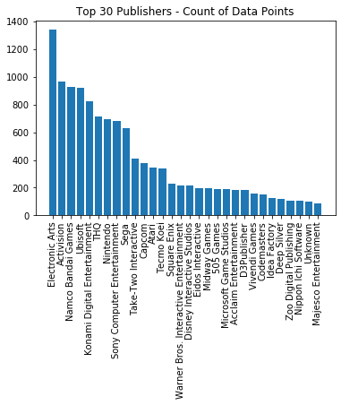
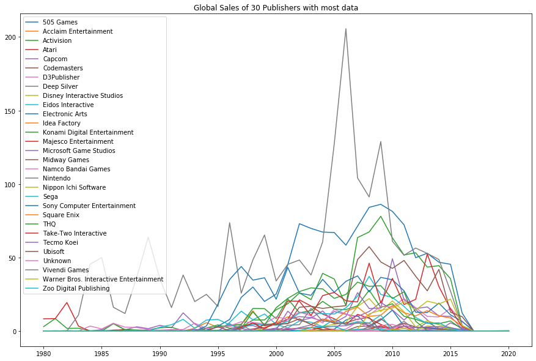
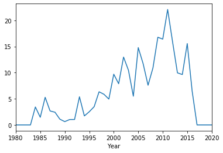
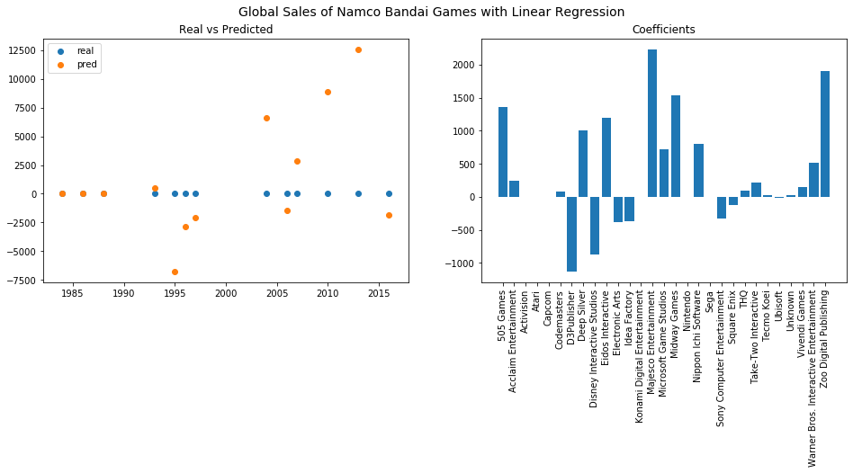
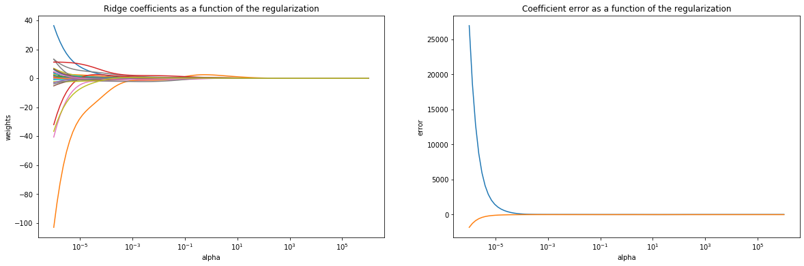
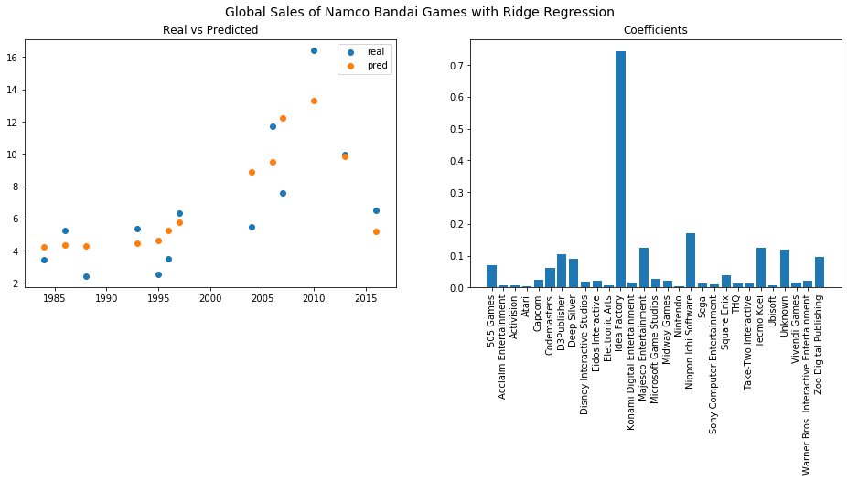
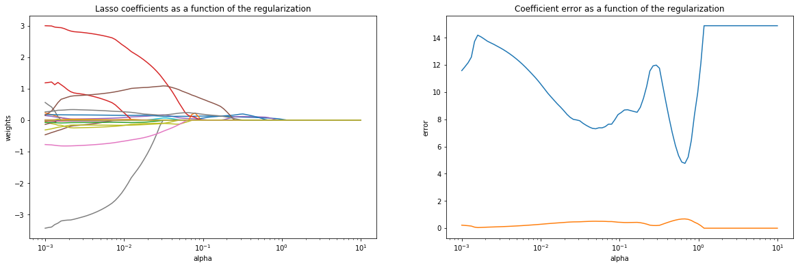
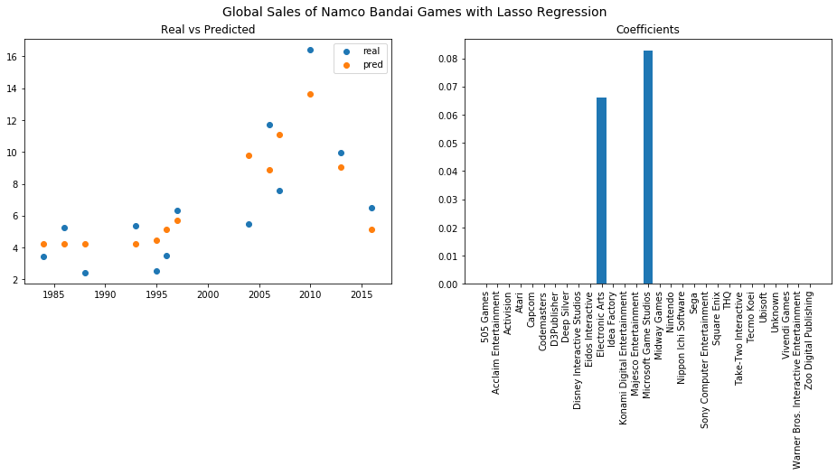

# Part I: Data Science/Decision Science - O-Notation - Graph-Based Algorithms, LASSO, Ridge,... 


<h1>Table of Contents<span class="tocSkip"></span></h1>
<div class="toc"><ul class="toc-item"><li><span><a href="#Part-I:-Data-Science/Decision-Science---O-Notation---Graph-Based-Algorithms,-LASSO,-Ridge,..." data-toc-modified-id="Part-I:-Data-Science/Decision-Science---O-Notation---Graph-Based-Algorithms,-LASSO,-Ridge,...-1"><span class="toc-item-num">1&nbsp;&nbsp;</span>Part I: Data Science/Decision Science - O-Notation - Graph-Based Algorithms, LASSO, Ridge,...</a></span><ul class="toc-item"><li><span><a href="#Data-Science-vs-Decision-Science" data-toc-modified-id="Data-Science-vs-Decision-Science-1.1"><span class="toc-item-num">1.1&nbsp;&nbsp;</span>Data Science vs Decision Science</a></span></li><li><span><a href="#O-Notation" data-toc-modified-id="O-Notation-1.2"><span class="toc-item-num">1.2&nbsp;&nbsp;</span>O-Notation</a></span></li><li><span><a href="#Generalized-Linear-Models" data-toc-modified-id="Generalized-Linear-Models-1.3"><span class="toc-item-num">1.3&nbsp;&nbsp;</span>Generalized Linear Models</a></span><ul class="toc-item"><li><span><a href="#Ridge-Regression" data-toc-modified-id="Ridge-Regression-1.3.1"><span class="toc-item-num">1.3.1&nbsp;&nbsp;</span>Ridge Regression</a></span></li><li><span><a href="#Lasso-Regression" data-toc-modified-id="Lasso-Regression-1.3.2"><span class="toc-item-num">1.3.2&nbsp;&nbsp;</span>Lasso Regression</a></span></li><li><span><a href="#Elastic-Net" data-toc-modified-id="Elastic-Net-1.3.3"><span class="toc-item-num">1.3.3&nbsp;&nbsp;</span>Elastic Net</a></span></li><li><span><a href="#Example-with-Videogames-Dataset" data-toc-modified-id="Example-with-Videogames-Dataset-1.3.4"><span class="toc-item-num">1.3.4&nbsp;&nbsp;</span>Example with Videogames Dataset</a></span><ul class="toc-item"><li><span><a href="#Prepare-dataset" data-toc-modified-id="Prepare-dataset-1.3.4.1"><span class="toc-item-num">1.3.4.1&nbsp;&nbsp;</span>Prepare dataset</a></span></li><li><span><a href="#Linear-Regression" data-toc-modified-id="Linear-Regression-1.3.4.2"><span class="toc-item-num">1.3.4.2&nbsp;&nbsp;</span>Linear Regression</a></span></li><li><span><a href="#Ridge-Regression" data-toc-modified-id="Ridge-Regression-1.3.4.3"><span class="toc-item-num">1.3.4.3&nbsp;&nbsp;</span>Ridge Regression</a></span></li><li><span><a href="#Lasso-Regression" data-toc-modified-id="Lasso-Regression-1.3.4.4"><span class="toc-item-num">1.3.4.4&nbsp;&nbsp;</span>Lasso Regression</a></span></li></ul></li></ul></li><li><span><a href="#Graph-Based-Algorithmns" data-toc-modified-id="Graph-Based-Algorithmns-1.4"><span class="toc-item-num">1.4&nbsp;&nbsp;</span>Graph Based Algorithmns</a></span></li></ul></li><li><span><a href="#Sources:" data-toc-modified-id="Sources:-2"><span class="toc-item-num">2&nbsp;&nbsp;</span><strong><em>Sources:</em></strong></a></span></li></ul></div>

##  Data Science vs Decision Science

There is often confusion between Data Science and Decision Science. However there is a major difference between these two terms:

**Data Science**
>"*Interdisciplinary field that uses scientific algorithms, methods, techniques and various approaches to extract valuable insight from structured and unstructured data.*"
>
>Data is the tool for business improvement and development.</center>
 
 
**Decision Science**

>"*An application of a complex of quantitative techniques to facilitate the decision-making process.*"
>
>Data is a tool to make decisions.


A data scientist is often dedicated to one specific product or feature and spends a lot of time gathering accurate data, running statistical analysis and improving it. He has deep knowledge of their product and less of the ecosystem.

A decision scientist normally supports the decision takers in a company, for example how much budget the marketing department should spend on tv advertisement. He is helping to make decisions about budgets and priorities and therefore prepares graphs and tables to support it. Basis is often the outcome of Data Science colleagues.

**Looking at the videogames sales dataset** a decision science use case could for example be to analyse if the sales was increasing or falling the year before and therefore the decision can be taken if a new videogame should be developed or not. A data science approach would rather analyse what were the influences of increasing or falling sales numbers (altough analysing a sales dataset is primarily useful to make a decision anyways.)


## O-Notation

>"*In programming, an algorithm is a process or set of rules to be followed in order to achieve a particular goal. An algorithm is >characterized by its running time (run-time), whether in terms of space or time. As data scientists, we are interested in the >most efficient algorithm so that we can optimize our workflow.*"

The picture below shows how the kind of operations in an algorithm influences the runtime.


For the videogames dataset, the O-Notation can for example play a role in a regression model for the sales data. Since linear models will always have advantages in computational power, especially generalized linear models are a good approach for regression.

## Generalized Linear Models

A linear relationship is a common way to describe the relationship between input variables $X_1, X_2, ..., X_n$ and an output variable $Y$ and is written as in the following formula, fitted using least squares:

$$ Y = \beta_0 + \beta_1 X_1 + ... + \beta_n X_n + \epsilon $$

Especially in real-world problems, a linear approach is often surprisingly competitive in comparison to a non-linear model.
That is why, before moving to a non-linear world, we want to take into account some approaches for extending the linear model framework. In these extensions, the plain least squares fitting is replaced with some alternative fitting procedures. They can have a better prediction accuracy than a model fitted using OLS, especially if the number of predictors is higher than the number of samples, since there will be too much variability in the least squares fit, resulting in overfitting. Furthermore, an alternative linear model can have a better model interpretability due to the possible exclusion of irrelevant variables.

Three of the alternative fitting approaches are the following:
- **Subset Selection**, where a subset of the available predictors is chosen either by *Best Subset Selection* (trying all combinations with any possible amount of predictors) or *Stepwise Selection* (starting with one predictor and stepwise adding new ones, starting with all predictors and stepwise removing the most irrelevant ones, or a combination). Besides statistical approaches to choose the best compromise between the model accuracy and the amount of predictors, cross validation is a more common approach.


- **Shrinkage Models** uses all predictors to fit a model, but uses a technique that shrinks the coefficient estimates towards zero and can therefore significantly reduce their variance. The two best known models are *Ridge Regression* and *Lasso Regression* which will be shown later in the chapter.


- **Dimension Reduction** projects the predictors into an M-Dimensional subspace, where M < as the amount of predictors. The projections aim to explain a big part of the variance in data and are used to fit a model using least squares.

### Ridge Regression

> "*Ridge Regression is very similar to learst squares, except that the coefficients are estimated by minimizing a slightly different quantity.*"


The *Ridge Regression* seeks identically as with least squares (*RSS*) coefficient estimates that fit the data well, by minimizing RSS. An additional term is added, $\lambda\sum_{j=1}^{p}\beta _{j}^{2}$, called the **shrinkage penalty**. The penalty is small when the coefficients $\beta_{1}, ...,\beta_{p}$ are close to zero, and therefore it has the effect of shrinking the estimates of $\beta_{j}$ to zero. The **tuning parameter** $\lambda$ controls the relative impact of the shrinkage penalty compared to the RSS. For selecting a good value for $\lambda$, again cross validation is the best approach.


> "*Ridge regression’s advantage over least squares is rooted in the bias-variance-trade-off. As $\lambda$ increases, the flexibility of the ridge regression fit decreases, leading to decreased variance but increased bias.*


A good use-case for Ridge Regression is for data where the relationship between predictors and response is close to linear. In this case, it can significantly reduce variance (resulting in slightly higher bias) and perform much better on the test dataset. And also if the number of predictors is higher than the numbers of samples: in this case, least squares may not even have a unique solution, whereas ridge regression still performs well.

### Lasso Regression
//Todo: Theory summary

### Elastic Net

Elastic Net is a combination of Ridge and Lasso Models.

### Example with Videogames Dataset

We want to compare linear regression with ridge and lasso regression on the videogames dataset.
#### Prepare dataset


```python
import pandas as pd
import seaborn as sns
import numpy as np
import matplotlib.pyplot as plt
import datetime
from sklearn.linear_model import LinearRegression
import operator
from sklearn.preprocessing import PolynomialFeatures

with open('./vgsales.csv', mode='r') as file:
    df = pd.read_csv(file)

df
```


<div>
<style scoped>
    .dataframe tbody tr th:only-of-type {
        vertical-align: middle;
    }

    .dataframe tbody tr th {
        vertical-align: top;
    }

    .dataframe thead th {
        text-align: right;
    }
</style>
<table border="1" class="dataframe">
  <thead>
    <tr style="text-align: right;">
      <th></th>
      <th>Rank</th>
      <th>Name</th>
      <th>Platform</th>
      <th>Year</th>
      <th>Genre</th>
      <th>Publisher</th>
      <th>NA_Sales</th>
      <th>EU_Sales</th>
      <th>JP_Sales</th>
      <th>Other_Sales</th>
      <th>Global_Sales</th>
    </tr>
  </thead>
  <tbody>
    <tr>
      <th>0</th>
      <td>1</td>
      <td>Wii Sports</td>
      <td>Wii</td>
      <td>2006.0</td>
      <td>Sports</td>
      <td>Nintendo</td>
      <td>41.49</td>
      <td>29.02</td>
      <td>3.77</td>
      <td>8.46</td>
      <td>82.74</td>
    </tr>
    <tr>
      <th>1</th>
      <td>2</td>
      <td>Super Mario Bros.</td>
      <td>NES</td>
      <td>1985.0</td>
      <td>Platform</td>
      <td>Nintendo</td>
      <td>29.08</td>
      <td>3.58</td>
      <td>6.81</td>
      <td>0.77</td>
      <td>40.24</td>
    </tr>
    <tr>
      <th>2</th>
      <td>3</td>
      <td>Mario Kart Wii</td>
      <td>Wii</td>
      <td>2008.0</td>
      <td>Racing</td>
      <td>Nintendo</td>
      <td>15.85</td>
      <td>12.88</td>
      <td>3.79</td>
      <td>3.31</td>
      <td>35.82</td>
    </tr>
    <tr>
      <th>3</th>
      <td>4</td>
      <td>Wii Sports Resort</td>
      <td>Wii</td>
      <td>2009.0</td>
      <td>Sports</td>
      <td>Nintendo</td>
      <td>15.75</td>
      <td>11.01</td>
      <td>3.28</td>
      <td>2.96</td>
      <td>33.00</td>
    </tr>
    <tr>
      <th>4</th>
      <td>5</td>
      <td>Pokemon Red/Pokemon Blue</td>
      <td>GB</td>
      <td>1996.0</td>
      <td>Role-Playing</td>
      <td>Nintendo</td>
      <td>11.27</td>
      <td>8.89</td>
      <td>10.22</td>
      <td>1.00</td>
      <td>31.37</td>
    </tr>
    <tr>
      <th>...</th>
      <td>...</td>
      <td>...</td>
      <td>...</td>
      <td>...</td>
      <td>...</td>
      <td>...</td>
      <td>...</td>
      <td>...</td>
      <td>...</td>
      <td>...</td>
      <td>...</td>
    </tr>
    <tr>
      <th>16593</th>
      <td>16596</td>
      <td>Woody Woodpecker in Crazy Castle 5</td>
      <td>GBA</td>
      <td>2002.0</td>
      <td>Platform</td>
      <td>Kemco</td>
      <td>0.01</td>
      <td>0.00</td>
      <td>0.00</td>
      <td>0.00</td>
      <td>0.01</td>
    </tr>
    <tr>
      <th>16594</th>
      <td>16597</td>
      <td>Men in Black II: Alien Escape</td>
      <td>GC</td>
      <td>2003.0</td>
      <td>Shooter</td>
      <td>Infogrames</td>
      <td>0.01</td>
      <td>0.00</td>
      <td>0.00</td>
      <td>0.00</td>
      <td>0.01</td>
    </tr>
    <tr>
      <th>16595</th>
      <td>16598</td>
      <td>SCORE International Baja 1000: The Official Game</td>
      <td>PS2</td>
      <td>2008.0</td>
      <td>Racing</td>
      <td>Activision</td>
      <td>0.00</td>
      <td>0.00</td>
      <td>0.00</td>
      <td>0.00</td>
      <td>0.01</td>
    </tr>
    <tr>
      <th>16596</th>
      <td>16599</td>
      <td>Know How 2</td>
      <td>DS</td>
      <td>2010.0</td>
      <td>Puzzle</td>
      <td>7G//AMES</td>
      <td>0.00</td>
      <td>0.01</td>
      <td>0.00</td>
      <td>0.00</td>
      <td>0.01</td>
    </tr>
    <tr>
      <th>16597</th>
      <td>16600</td>
      <td>Spirits &amp; Spells</td>
      <td>GBA</td>
      <td>2003.0</td>
      <td>Platform</td>
      <td>Wanadoo</td>
      <td>0.01</td>
      <td>0.00</td>
      <td>0.00</td>
      <td>0.00</td>
      <td>0.01</td>
    </tr>
  </tbody>
</table>
<p>16598 rows × 11 columns</p>
</div>


```python
# show NaNs
df.isnull().sum()
```


    Rank              0
    Name              0
    Platform          0
    Year            271
    Genre             0
    Publisher        58
    NA_Sales          0
    EU_Sales          0
    JP_Sales          0
    Other_Sales       0
    Global_Sales      0
    dtype: int64


```python
# drop NaNs, since there are not so many of them
df = df.dropna()
```

We finally want to predict the Global Sales of one Publisher in a specific year, based on sales data of all other Pusblishers. Therefore we group the data.


```python
df_gr = df.groupby(['Year','Publisher']).sum()
df_gr = df_gr.drop(['Rank'], axis=1)
df_gr.head()
```


<div>
<style scoped>
    .dataframe tbody tr th:only-of-type {
        vertical-align: middle;
    }

    .dataframe tbody tr th {
        vertical-align: top;
    }

    .dataframe thead th {
        text-align: right;
    }
</style>
<table border="1" class="dataframe">
  <thead>
    <tr style="text-align: right;">
      <th></th>
      <th></th>
      <th>NA_Sales</th>
      <th>EU_Sales</th>
      <th>JP_Sales</th>
      <th>Other_Sales</th>
      <th>Global_Sales</th>
    </tr>
    <tr>
      <th>Year</th>
      <th>Publisher</th>
      <th></th>
      <th></th>
      <th></th>
      <th></th>
      <th></th>
    </tr>
  </thead>
  <tbody>
    <tr>
      <th rowspan="2" valign="top">1980.0</th>
      <th>Activision</th>
      <td>2.82</td>
      <td>0.18</td>
      <td>0.0</td>
      <td>0.03</td>
      <td>3.02</td>
    </tr>
    <tr>
      <th>Atari</th>
      <td>7.77</td>
      <td>0.49</td>
      <td>0.0</td>
      <td>0.09</td>
      <td>8.36</td>
    </tr>
    <tr>
      <th rowspan="3" valign="top">1981.0</th>
      <th>20th Century Fox Video Games</th>
      <td>1.27</td>
      <td>0.07</td>
      <td>0.0</td>
      <td>0.01</td>
      <td>1.35</td>
    </tr>
    <tr>
      <th>Activision</th>
      <td>7.95</td>
      <td>0.46</td>
      <td>0.0</td>
      <td>0.08</td>
      <td>8.50</td>
    </tr>
    <tr>
      <th>Atari</th>
      <td>7.87</td>
      <td>0.47</td>
      <td>0.0</td>
      <td>0.08</td>
      <td>8.45</td>
    </tr>
  </tbody>
</table>
</div>


```python
test = df_gr.unstack(level=-1)
test.columns = [' '.join(col).strip() for col in test.columns.values]
test.head()
```


<div>
<style scoped>
    .dataframe tbody tr th:only-of-type {
        vertical-align: middle;
    }

    .dataframe tbody tr th {
        vertical-align: top;
    }

    .dataframe thead th {
        text-align: right;
    }
</style>
<table border="1" class="dataframe">
  <thead>
    <tr style="text-align: right;">
      <th></th>
      <th>NA_Sales 10TACLE Studios</th>
      <th>NA_Sales 1C Company</th>
      <th>NA_Sales 20th Century Fox Video Games</th>
      <th>NA_Sales 2D Boy</th>
      <th>NA_Sales 3DO</th>
      <th>NA_Sales 49Games</th>
      <th>NA_Sales 505 Games</th>
      <th>NA_Sales 5pb</th>
      <th>NA_Sales 7G//AMES</th>
      <th>NA_Sales 989 Sports</th>
      <th>...</th>
      <th>Global_Sales Zushi Games</th>
      <th>Global_Sales bitComposer Games</th>
      <th>Global_Sales dramatic create</th>
      <th>Global_Sales fonfun</th>
      <th>Global_Sales iWin</th>
      <th>Global_Sales id Software</th>
      <th>Global_Sales imageepoch Inc.</th>
      <th>Global_Sales inXile Entertainment</th>
      <th>Global_Sales mixi, Inc</th>
      <th>Global_Sales responDESIGN</th>
    </tr>
    <tr>
      <th>Year</th>
      <th></th>
      <th></th>
      <th></th>
      <th></th>
      <th></th>
      <th></th>
      <th></th>
      <th></th>
      <th></th>
      <th></th>
      <th></th>
      <th></th>
      <th></th>
      <th></th>
      <th></th>
      <th></th>
      <th></th>
      <th></th>
      <th></th>
      <th></th>
      <th></th>
    </tr>
  </thead>
  <tbody>
    <tr>
      <th>1980.0</th>
      <td>NaN</td>
      <td>NaN</td>
      <td>NaN</td>
      <td>NaN</td>
      <td>NaN</td>
      <td>NaN</td>
      <td>NaN</td>
      <td>NaN</td>
      <td>NaN</td>
      <td>NaN</td>
      <td>...</td>
      <td>NaN</td>
      <td>NaN</td>
      <td>NaN</td>
      <td>NaN</td>
      <td>NaN</td>
      <td>NaN</td>
      <td>NaN</td>
      <td>NaN</td>
      <td>NaN</td>
      <td>NaN</td>
    </tr>
    <tr>
      <th>1981.0</th>
      <td>NaN</td>
      <td>NaN</td>
      <td>1.27</td>
      <td>NaN</td>
      <td>NaN</td>
      <td>NaN</td>
      <td>NaN</td>
      <td>NaN</td>
      <td>NaN</td>
      <td>NaN</td>
      <td>...</td>
      <td>NaN</td>
      <td>NaN</td>
      <td>NaN</td>
      <td>NaN</td>
      <td>NaN</td>
      <td>NaN</td>
      <td>NaN</td>
      <td>NaN</td>
      <td>NaN</td>
      <td>NaN</td>
    </tr>
    <tr>
      <th>1982.0</th>
      <td>NaN</td>
      <td>NaN</td>
      <td>0.55</td>
      <td>NaN</td>
      <td>NaN</td>
      <td>NaN</td>
      <td>NaN</td>
      <td>NaN</td>
      <td>NaN</td>
      <td>NaN</td>
      <td>...</td>
      <td>NaN</td>
      <td>NaN</td>
      <td>NaN</td>
      <td>NaN</td>
      <td>NaN</td>
      <td>NaN</td>
      <td>NaN</td>
      <td>NaN</td>
      <td>NaN</td>
      <td>NaN</td>
    </tr>
    <tr>
      <th>1983.0</th>
      <td>NaN</td>
      <td>NaN</td>
      <td>NaN</td>
      <td>NaN</td>
      <td>NaN</td>
      <td>NaN</td>
      <td>NaN</td>
      <td>NaN</td>
      <td>NaN</td>
      <td>NaN</td>
      <td>...</td>
      <td>NaN</td>
      <td>NaN</td>
      <td>NaN</td>
      <td>NaN</td>
      <td>NaN</td>
      <td>NaN</td>
      <td>NaN</td>
      <td>NaN</td>
      <td>NaN</td>
      <td>NaN</td>
    </tr>
    <tr>
      <th>1984.0</th>
      <td>NaN</td>
      <td>NaN</td>
      <td>NaN</td>
      <td>NaN</td>
      <td>NaN</td>
      <td>NaN</td>
      <td>NaN</td>
      <td>NaN</td>
      <td>NaN</td>
      <td>NaN</td>
      <td>...</td>
      <td>NaN</td>
      <td>NaN</td>
      <td>NaN</td>
      <td>NaN</td>
      <td>NaN</td>
      <td>NaN</td>
      <td>NaN</td>
      <td>NaN</td>
      <td>NaN</td>
      <td>NaN</td>
    </tr>
  </tbody>
</table>
<p>5 rows × 2880 columns</p>
</div>


Well, this might not be a good idea with sooo many more columns compared to the rows/sampels. Let's see how many Publishers we have...


```python
len(df.Publisher.unique())
```


    576


This is quite a lot, for only 39 years to predict. Let's use the Global_Sales of the 30 Top Publishers for the prediciton.


```python
from collections import Counter 
pub_count = Counter(df.Publisher) 
res = pub_count.most_common(30)
```


```python
pub = pd.DataFrame([lis[1] for lis in res], [lis[0] for lis in res], columns=['Count'])
plt.bar(pub.index, pub.Count)
plt.xticks(rotation='vertical')
plt.title('Top 30 Publishers - Count of Data Points')
plt.show()
```





```python
gs = pd.DataFrame(df[df.Publisher.isin(pub.index)].groupby(['Year','Publisher']).sum().Global_Sales)
gs = gs.unstack(level=-1)
gs.columns = gs.columns.get_level_values(1)
gs.head()
```


<div>
<style scoped>
    .dataframe tbody tr th:only-of-type {
        vertical-align: middle;
    }

    .dataframe tbody tr th {
        vertical-align: top;
    }

    .dataframe thead th {
        text-align: right;
    }
</style>
<table border="1" class="dataframe">
  <thead>
    <tr style="text-align: right;">
      <th>Publisher</th>
      <th>505 Games</th>
      <th>Acclaim Entertainment</th>
      <th>Activision</th>
      <th>Atari</th>
      <th>Capcom</th>
      <th>Codemasters</th>
      <th>D3Publisher</th>
      <th>Deep Silver</th>
      <th>Disney Interactive Studios</th>
      <th>Eidos Interactive</th>
      <th>...</th>
      <th>Sony Computer Entertainment</th>
      <th>Square Enix</th>
      <th>THQ</th>
      <th>Take-Two Interactive</th>
      <th>Tecmo Koei</th>
      <th>Ubisoft</th>
      <th>Unknown</th>
      <th>Vivendi Games</th>
      <th>Warner Bros. Interactive Entertainment</th>
      <th>Zoo Digital Publishing</th>
    </tr>
    <tr>
      <th>Year</th>
      <th></th>
      <th></th>
      <th></th>
      <th></th>
      <th></th>
      <th></th>
      <th></th>
      <th></th>
      <th></th>
      <th></th>
      <th></th>
      <th></th>
      <th></th>
      <th></th>
      <th></th>
      <th></th>
      <th></th>
      <th></th>
      <th></th>
      <th></th>
      <th></th>
    </tr>
  </thead>
  <tbody>
    <tr>
      <th>1980.0</th>
      <td>NaN</td>
      <td>NaN</td>
      <td>3.02</td>
      <td>8.36</td>
      <td>NaN</td>
      <td>NaN</td>
      <td>NaN</td>
      <td>NaN</td>
      <td>NaN</td>
      <td>NaN</td>
      <td>...</td>
      <td>NaN</td>
      <td>NaN</td>
      <td>NaN</td>
      <td>NaN</td>
      <td>NaN</td>
      <td>NaN</td>
      <td>NaN</td>
      <td>NaN</td>
      <td>NaN</td>
      <td>NaN</td>
    </tr>
    <tr>
      <th>1981.0</th>
      <td>NaN</td>
      <td>NaN</td>
      <td>8.50</td>
      <td>8.45</td>
      <td>NaN</td>
      <td>NaN</td>
      <td>NaN</td>
      <td>NaN</td>
      <td>NaN</td>
      <td>NaN</td>
      <td>...</td>
      <td>NaN</td>
      <td>NaN</td>
      <td>NaN</td>
      <td>NaN</td>
      <td>NaN</td>
      <td>NaN</td>
      <td>0.29</td>
      <td>NaN</td>
      <td>NaN</td>
      <td>NaN</td>
    </tr>
    <tr>
      <th>1982.0</th>
      <td>NaN</td>
      <td>NaN</td>
      <td>1.86</td>
      <td>19.43</td>
      <td>NaN</td>
      <td>NaN</td>
      <td>NaN</td>
      <td>NaN</td>
      <td>NaN</td>
      <td>NaN</td>
      <td>...</td>
      <td>NaN</td>
      <td>NaN</td>
      <td>NaN</td>
      <td>NaN</td>
      <td>NaN</td>
      <td>NaN</td>
      <td>NaN</td>
      <td>NaN</td>
      <td>NaN</td>
      <td>NaN</td>
    </tr>
    <tr>
      <th>1983.0</th>
      <td>NaN</td>
      <td>NaN</td>
      <td>1.94</td>
      <td>3.39</td>
      <td>NaN</td>
      <td>NaN</td>
      <td>NaN</td>
      <td>NaN</td>
      <td>NaN</td>
      <td>NaN</td>
      <td>...</td>
      <td>NaN</td>
      <td>NaN</td>
      <td>NaN</td>
      <td>NaN</td>
      <td>NaN</td>
      <td>NaN</td>
      <td>NaN</td>
      <td>NaN</td>
      <td>NaN</td>
      <td>NaN</td>
    </tr>
    <tr>
      <th>1984.0</th>
      <td>NaN</td>
      <td>NaN</td>
      <td>0.27</td>
      <td>NaN</td>
      <td>NaN</td>
      <td>NaN</td>
      <td>NaN</td>
      <td>NaN</td>
      <td>NaN</td>
      <td>NaN</td>
      <td>...</td>
      <td>NaN</td>
      <td>NaN</td>
      <td>NaN</td>
      <td>NaN</td>
      <td>NaN</td>
      <td>NaN</td>
      <td>NaN</td>
      <td>NaN</td>
      <td>NaN</td>
      <td>NaN</td>
    </tr>
  </tbody>
</table>
<p>5 rows × 30 columns</p>
</div>


Now it looks better - we have 29 predictors for one variable to predict with 39 samples. Looks like a great regression sample. We should just impute the NaNs with zero and choose a Publisher to predict which has not many NaNs.


```python
gs.isna().sum()
gs = gs.fillna(0)

plt.figure(figsize=[15,10])
plt.plot(gs)
plt.title('Global Sales of 30 Publishers with most data')
plt.legend(gs.columns)
```


    <matplotlib.legend.Legend at 0x26ba79ba848>





We will predict Namco Bandai Games.


```python
gs['Namco Bandai Games'].plot()
```


    <matplotlib.axes._subplots.AxesSubplot at 0x26ba7ca1ec8>





Lets create the train and test data sets.


```python
# choose columns
y = gs['Namco Bandai Games']
X = gs.drop(['Namco Bandai Games'], axis = 1)
```


```python
# train test split
from sklearn.model_selection import train_test_split

X_train, X_test, y_train, y_test = train_test_split(X, y, test_size=0.33, random_state=42)
```


```python
X_train.head()
```


<div>
<style scoped>
    .dataframe tbody tr th:only-of-type {
        vertical-align: middle;
    }

    .dataframe tbody tr th {
        vertical-align: top;
    }

    .dataframe thead th {
        text-align: right;
    }
</style>
<table border="1" class="dataframe">
  <thead>
    <tr style="text-align: right;">
      <th>Publisher</th>
      <th>505 Games</th>
      <th>Acclaim Entertainment</th>
      <th>Activision</th>
      <th>Atari</th>
      <th>Capcom</th>
      <th>Codemasters</th>
      <th>D3Publisher</th>
      <th>Deep Silver</th>
      <th>Disney Interactive Studios</th>
      <th>Eidos Interactive</th>
      <th>...</th>
      <th>Sony Computer Entertainment</th>
      <th>Square Enix</th>
      <th>THQ</th>
      <th>Take-Two Interactive</th>
      <th>Tecmo Koei</th>
      <th>Ubisoft</th>
      <th>Unknown</th>
      <th>Vivendi Games</th>
      <th>Warner Bros. Interactive Entertainment</th>
      <th>Zoo Digital Publishing</th>
    </tr>
    <tr>
      <th>Year</th>
      <th></th>
      <th></th>
      <th></th>
      <th></th>
      <th></th>
      <th></th>
      <th></th>
      <th></th>
      <th></th>
      <th></th>
      <th></th>
      <th></th>
      <th></th>
      <th></th>
      <th></th>
      <th></th>
      <th></th>
      <th></th>
      <th></th>
      <th></th>
      <th></th>
    </tr>
  </thead>
  <tbody>
    <tr>
      <th>1992.0</th>
      <td>0.00</td>
      <td>0.00</td>
      <td>0.00</td>
      <td>0.00</td>
      <td>12.40</td>
      <td>0.00</td>
      <td>0.00</td>
      <td>0.00</td>
      <td>0.00</td>
      <td>0.00</td>
      <td>...</td>
      <td>0.00</td>
      <td>0.00</td>
      <td>0.00</td>
      <td>0.00</td>
      <td>0.29</td>
      <td>0.00</td>
      <td>0.00</td>
      <td>0.0</td>
      <td>0.00</td>
      <td>0.0</td>
    </tr>
    <tr>
      <th>1999.0</th>
      <td>0.00</td>
      <td>3.83</td>
      <td>7.57</td>
      <td>2.30</td>
      <td>0.88</td>
      <td>0.61</td>
      <td>0.00</td>
      <td>0.00</td>
      <td>1.94</td>
      <td>11.64</td>
      <td>...</td>
      <td>36.24</td>
      <td>0.00</td>
      <td>4.01</td>
      <td>1.68</td>
      <td>0.63</td>
      <td>4.61</td>
      <td>0.00</td>
      <td>0.4</td>
      <td>0.00</td>
      <td>0.0</td>
    </tr>
    <tr>
      <th>1989.0</th>
      <td>0.00</td>
      <td>0.00</td>
      <td>0.47</td>
      <td>0.15</td>
      <td>1.67</td>
      <td>0.00</td>
      <td>0.00</td>
      <td>0.00</td>
      <td>0.00</td>
      <td>0.00</td>
      <td>...</td>
      <td>0.00</td>
      <td>0.00</td>
      <td>0.00</td>
      <td>0.00</td>
      <td>0.00</td>
      <td>0.00</td>
      <td>0.00</td>
      <td>0.0</td>
      <td>0.00</td>
      <td>0.0</td>
    </tr>
    <tr>
      <th>2012.0</th>
      <td>2.34</td>
      <td>0.00</td>
      <td>53.25</td>
      <td>0.05</td>
      <td>14.68</td>
      <td>2.81</td>
      <td>0.29</td>
      <td>0.64</td>
      <td>2.84</td>
      <td>0.00</td>
      <td>...</td>
      <td>12.85</td>
      <td>10.37</td>
      <td>6.70</td>
      <td>21.58</td>
      <td>2.43</td>
      <td>37.31</td>
      <td>0.32</td>
      <td>0.0</td>
      <td>14.33</td>
      <td>0.0</td>
    </tr>
    <tr>
      <th>1980.0</th>
      <td>0.00</td>
      <td>0.00</td>
      <td>3.02</td>
      <td>8.36</td>
      <td>0.00</td>
      <td>0.00</td>
      <td>0.00</td>
      <td>0.00</td>
      <td>0.00</td>
      <td>0.00</td>
      <td>...</td>
      <td>0.00</td>
      <td>0.00</td>
      <td>0.00</td>
      <td>0.00</td>
      <td>0.00</td>
      <td>0.00</td>
      <td>0.00</td>
      <td>0.0</td>
      <td>0.00</td>
      <td>0.0</td>
    </tr>
  </tbody>
</table>
<p>5 rows × 29 columns</p>
</div>


#### Linear Regression

For comparability, we will try to make a linear regression model to predict the Global Sales of Namco Bandai Games.


```python
#Import Linear Regression model from scikit-learn.
from sklearn.linear_model import LinearRegression
from sklearn.metrics import r2_score, mean_squared_error

#Fit the model
linreg = LinearRegression(normalize=True)
linreg.fit(X_train,y_train)
y_pred = linreg.predict(X_test)

coef = linreg.coef_

# model metrics
print('R2:   ', r2_score(y_test, y_pred))
print('MSE:  ', mean_squared_error(y_test, y_pred))
```

    R2:    -1821914.037616515
    MSE:   27017027.164942358
    


```python
def plt_reg(y_test, y_pred, coef, modelname = 'Regression'):
    plt.figure(figsize=[16, 5])
    plt.suptitle('Global Sales of Namco Bandai Games with {}'.format(modelname), fontsize=14)
    
    plt.subplot(121)
    plt.scatter(y_test.index, y_test)
    plt.scatter(y_test.index, y_pred)
    plt.title('Real vs Predicted')
    plt.legend(['real', 'pred'])
    
    plt.subplot(122)
    plt.bar(X_train.columns, coef)
    plt.xticks(rotation='vertical')
    plt.title('Coefficients')
        
    plt.show()
    
plt_reg(y_test, y_pred, coef, 'Linear Regression')
```





We see from the R2 and MSE, as well as in the scatter plot comparing the real and the predicted valies, that the predictions don't make any sense. The simple linear regression is not able to make acceptable predictions. As summarized in the theoretical description, the reason is most probably that the amount of predictors is approximately the same as the number of samples, there is too much variance.

#### Ridge Regression


```python
# adapted from <Kornel Kielczewski -- <kornel.k@plusnet.pl>
from sklearn.linear_model import Ridge

clf = Ridge(normalize=True)

coefs = []
errors = []
r_squ = []

alphas = np.logspace(-6, 6, 100)

# Train the model with different regularisation strengths
for a in alphas:
    clf.set_params(alpha=a)
    clf.fit(X_train, y_train)
    coefs.append(clf.coef_)
    errors.append(mean_squared_error(y_test, clf.predict(X_test)))
    r_squ.append(r2_score(y_test, clf.predict(X_test)))

# Display results
plt.figure(figsize=(20, 6))

plt.subplot(121)
ax = plt.gca()
ax.plot(alphas, coefs)
ax.set_xscale('log')
plt.xlabel('alpha')
plt.ylabel('weights')
plt.title('Ridge coefficients as a function of the regularization')
plt.axis('tight')

plt.subplot(122)
ax = plt.gca()
ax.plot(alphas, errors)
ax.plot(alphas, r_squ)
ax.set_xscale('log')
plt.xlabel('alpha')
plt.ylabel('error')
plt.title('Coefficient error as a function of the regularization')
plt.axis('tight')

plt.show()

# get best alpha
best_alpha = alphas[errors.index(min(errors))]
print('Best Alpha: ', best_alpha)
```





    Best Alpha:  18.738174228603867
    


```python
#Fit the Ridge model
ridgereg = Ridge(alpha=best_alpha,normalize=True)
ridgereg.fit(X_train,y_train)
y_pred = ridgereg.predict(X_test)

coef = ridgereg.coef_

# model metrics
print('R2:   ', r2_score(y_test, y_pred))
print('MSE:  ', mean_squared_error(y_test, y_pred))

plt_reg(y_test, y_pred, coef, 'Ridge Regression')
```

    R2:    0.6747626548257615
    MSE:   4.822917648850129
    





// Todo: Interpretation

#### Lasso Regression


```python
# adapted from <Kornel Kielczewski -- <kornel.k@plusnet.pl>
from sklearn.linear_model import Lasso
clf = Lasso(normalize=True, max_iter=5000)

coefs = []
errors = []
r_squ = []

alphas = np.logspace(-3, 1, 100)

# Train the model with different regularisation strengths
for a in alphas:
    clf.set_params(alpha=a)
    clf.fit(X_train, y_train)
    coefs.append(clf.coef_)
    errors.append(mean_squared_error(y_test, clf.predict(X_test)))
    r_squ.append(r2_score(y_test, clf.predict(X_test)))

# Display results
plt.figure(figsize=(20, 6))

plt.subplot(121)
ax = plt.gca()
ax.plot(alphas, coefs)
ax.set_xscale('log')
plt.xlabel('alpha')
plt.ylabel('weights')
plt.title('Lasso coefficients as a function of the regularization')
plt.axis('tight')

plt.subplot(122)
ax = plt.gca()
ax.plot(alphas, errors)
ax.plot(alphas, r_squ)
ax.set_xscale('log')
plt.xlabel('alpha')
plt.ylabel('error')
plt.title('Coefficient error as a function of the regularization')
plt.axis('tight')

plt.show()

# get best alpha
best_alpha = alphas[errors.index(min(errors))]
print('Best Alpha: ', best_alpha)
```





    Best Alpha:  0.6734150657750828
    


```python
#Fit the Lasso model
lassoreg = Lasso(alpha=best_alpha,normalize=True)
lassoreg.fit(X_train,y_train)
y_pred = lassoreg.predict(X_test)

coef = lassoreg.coef_

# model metrics
print('R2:   ', r2_score(y_test, y_pred))
print('MSE:  ', mean_squared_error(y_test, y_pred))

plt_reg(y_test, y_pred, coef, 'Lasso Regression')
```

    R2:    0.6788742601240231
    MSE:   4.761946994488563
    





```python
coef
```


    array([0.        , 0.        , 0.        , 0.        , 0.        ,
           0.        , 0.        , 0.        , 0.        , 0.        ,
           0.06605508, 0.        , 0.        , 0.        , 0.08288048,
           0.        , 0.        , 0.        , 0.        , 0.        ,
           0.        , 0.        , 0.        , 0.        , 0.        ,
           0.        , 0.        , 0.        , 0.        ])


//Todo: Interpretation

There are only two coefficients left!

## Graph Based Algorithmns

https://towardsdatascience.com/data-scientists-the-five-graph-algorithms-that-you-should-know-30f454fa5513

# ***Sources:*** 

*https://www.kdnuggets.com/2019/05/data-science-vs-decision-science.html*

*https://towardsdatascience.com/data-science-vs-decision-science-8f8d53ce25da*

*ISL - Chapter 6: Linear Model Selection and Regularization*

*https://towardsdatascience.com/a-data-scientists-guide-to-data-structures-algorithms-1176395015a0*

*https://dev.to/b0nbon1/understanding-big-o-notation-with-javascript-25mc*

*https://www.analyticsvidhya.com/blog/2016/01/ridge-lasso-regression-python-complete-tutorial/*

*https://scikit-learn.org/stable/auto_examples/linear_model/plot_ridge_coeffs.html#sphx-glr-auto-examples-linear-model-plot-ridge-coeffs-py*
