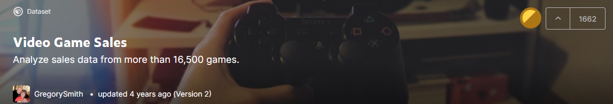

# Seminararbeit Algorithmik und Statistik 2 ILV
## Videogames Datensatz

###### Nicole Diewald | Paul Leitner | Netchie Dürregger | Albert Moser | Johannes Georg Larcher | Matthias Sammer

Introduction

[Part I: Data Science vs Decision Science, O-NOtation, GLMs, Graphical Models](DatavsDecision_ONot_GLMs.html)
